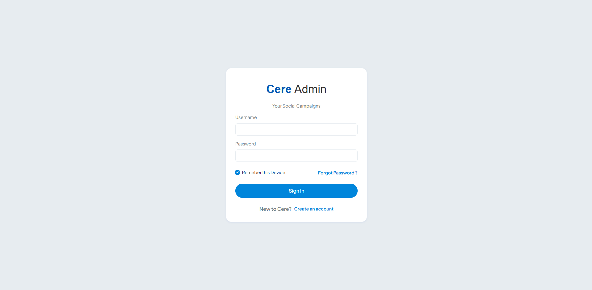

<p align="center">
  
</p>

<h1 align="center">Cere Admin Dashboard</h1>

<p align="center">
  <strong>A modern, feature-rich admin dashboard template built with Bootstrap 5, SCSS & ApexCharts.</strong>
</p>

<p align="center">
  
  
  
  
  
</p>

<br />

<p align="center">
  
  
  
</p>

---

## ✨ Overview

**Cere Admin** is a sleek and professional admin dashboard template designed to accelerate your next web project. Whether you're building a SaaS platform, an internal tool, an e-commerce back-office, or a CMS — Cere provides a solid, extensible foundation with beautiful UI components and interactive charts out of the box.

> 🎨 *Designed and Developed by **Ahmad Husirami***

---

## 🖼️ Preview

| Dashboard | Login Page |
|:---------:|:----------:|
|  |  |

> 💡 *Replace the placeholder images above with actual screenshots of your running application.*

---

## 🚀 Key Features

<table>
  <tr>
    <td width="50%">

### 📊 Dashboard & Analytics
- **Profit & Expenses** — Interactive area/bar charts
- **Traffic Distribution** — Donut chart with organic vs referral breakdown
- **Product Sales** — Real-time sales tracking with trend indicators
- **Top Paying Clients** — Sortable data table with status badges

</td>
<td width="50%">

### 🧩 Rich UI Components
- Buttons, Alerts, Cards, Forms, Typography
- Accordions, Badges, Dropdowns, Modals, Tabs
- Tooltips, Popovers, Notifications, Progress Bars
- Pagination, Breadcrumbs, Offcanvas, Carousels

</td>
  </tr>
  <tr>
    <td>

### 🛍️ Application Pages
- **E-Commerce** — Shop, Details, List, Checkout, Add/Edit Product
- **Blog** — Posts listing & Blog details
- **Email, Calendar, Kanban, Chat, Notes**
- **Contact Table & Contact List**
- **Invoice** generation layout
- **User Profile** page

</td>
<td>

### 🔐 Authentication
- Login & Register pages (boxed layout)
- Side Login & Side Register variants
- Forgot Password flows
- Two-Step Verification
- Error & Maintenance pages

</td>
  </tr>
  <tr>
    <td>

### 📈 Charts
- Line, Area & Bar Charts
- Pie & Donut Charts
- Radial & Radar Charts
- Powered by **ApexCharts**

</td>
<td>

### 🎛️ Forms & Widgets
- Input groups, grids, checkboxes & radios
- Bootstrap Switch, Select2, Dropzone
- Form masks, typeahead autocomplete
- Widget cards, banners, feeds & data widgets

</td>
  </tr>
</table>

### 🌟 Additional Highlights

- ✅ **Fully Responsive** — Pixel-perfect on desktop, tablet & mobile
- ✅ **Clean & Organized Code** — Modular SCSS architecture
- ✅ **Collapsible Sidebar** — Fixed sidebar with multi-level navigation
- ✅ **Notification Bell** — Header dropdown notifications
- ✅ **User Profile Menu** — Quick access to profile, account & tasks
- ✅ **Product Cards** — E-commerce product display with ratings
- ✅ **Timeline Widget** — Upcoming schedules with color-coded events
- ✅ **Front Pages** — Homepage, About, Blog, Contact, Portfolio, Pricing
- ✅ **Icon Libraries** — Solar Icons (Iconify) + Tabler Icons
- ✅ **Smooth Scrollbar** — SimpleBar integration for sidebar scroll
- ✅ **Dark-mode Ready** — Easy to extend with dark theme variables

---

## 🛠️ Tech Stack

| Layer       | Technology                                                                 |
|-------------|---------------------------------------------------------------------------|
| **Markup**  | HTML5, Semantic elements                                                  |
| **Styling** | Bootstrap 5.3, Custom SCSS (Plus Jakarta Sans font)                       |
| **Scripts** | jQuery 3.6, Vanilla JS                                                    |
| **Charts**  | ApexCharts 3.54                                                           |
| **Icons**   | [Iconify Solar Icons](https://icon-sets.iconify.design/solar/), Tabler    |
| **Scrollbar** | SimpleBar                                                              |
| **Build**   | Sass CLI (`npx sass`)                                                     |

---

## 📂 Project Structure

```
Cere-Admin-Github/
│
├── src/
│   ├── index.html                    # 🏠 Main dashboard page
│   │
│   ├── pages/
│   │   ├── authentication-login.html     # Login page
│   │   ├── authentication-register.html  # Register page
│   │   ├── ui-alerts.html                # Alerts showcase
│   │   ├── ui-buttons.html               # Buttons showcase
│   │   ├── ui-card.html                  # Cards showcase
│   │   ├── ui-forms.html                 # Forms showcase
│   │   ├── ui-typography.html            # Typography showcase
│   │   ├── icon-tabler.html              # Tabler icons reference
│   │   └── sample-page.html              # Starter template page
│   │
│   └── assets/
│       ├── css/
│       │   ├── styles.min.css            # Compiled CSS
│       │   └── icons/                    # Icon font stylesheets
│       ├── scss/
│       │   ├── styles.scss               # Main SCSS entry point
│       │   ├── variables/                # Theme & Bootstrap variables
│       │   ├── layouts/                  # Sidebar, header, layout styles
│       │   ├── component/                # Reboot & card styles
│       │   ├── utilities/                # Icon-size utilities
│       │   └── pages/                    # Page-specific styles
│       ├── js/
│       │   ├── app.min.js                # Core app scripts
│       │   ├── sidebarmenu.js            # Sidebar toggle & navigation
│       │   └── dashboard.js              # ApexCharts initialization
│       ├── images/
│       │   ├── logos/                    # Brand logos & favicon
│       │   ├── products/                 # Product card images
│       │   └── profile/                  # User avatar images
│       └── libs/
│           ├── bootstrap/                # Bootstrap 5 source
│           ├── jquery/                   # jQuery library
│           ├── apexcharts/               # ApexCharts library
│           └── simplebar/                # SimpleBar scrollbar
│
├── package.json
├── .gitignore
└── README.md
```

---

## ⚡ Getting Started

### Prerequisites

- [Node.js](https://nodejs.org/) (v16 or later recommended)
- npm (comes with Node.js)

### Installation

```bash
# 1. Clone the repository
git clone https://github.com/AhmadHusirami/Cere-Admin-Github.git

# 2. Navigate to the project folder
cd Cere-Admin-Github

# 3. Install dependencies
npm install
```

### Development

```bash
# Compile SCSS and watch for changes
npm run compile-sass
```

This will watch `src/assets/scss/styles.scss` and automatically compile changes into `src/assets/css/styles.min.css`.

### View the Dashboard

Simply open `src/index.html` in your browser — no server required!

```bash
# Or use a live server (e.g., VS Code Live Server extension)
# Right-click on src/index.html → Open with Live Server
```

---

## 🎨 Customization

### Changing Theme Colors

Edit the SCSS variables in `src/assets/scss/variables/`:

```scss
// variables/_variables.scss
$primary:   #5D87FF;
$secondary: #49BEFF;
$success:   #13DEB9;
$danger:    #FA896B;
$warning:   #FFAE1F;
```

Then recompile with `npm run compile-sass`.

### Adding New Pages

1. Copy `src/pages/sample-page.html` as your starter
2. Add your content inside the main wrapper
3. Link the page in the sidebar navigation in `src/index.html`

---

## 📋 Available Scripts

| Command                | Description                                        |
|------------------------|----------------------------------------------------|
| `npm run compile-sass` | Compile SCSS to CSS with live watch mode            |
| `npm start`            | Alias for compile-sass (StackBlitz compatible)      |

---

## 🤝 Contributing

Contributions are welcome! If you'd like to contribute:

1. **Fork** the repository
2. **Create** a feature branch (`git checkout -b feature/amazing-feature`)
3. **Commit** your changes (`git commit -m 'Add amazing feature'`)
4. **Push** to the branch (`git push origin feature/amazing-feature`)
5. **Open** a Pull Request

---

## 📄 License

This project is licensed under the **MIT License** — see the [LICENSE](LICENSE) file for details.

---

## 🙏 Acknowledgements

- [Bootstrap](https://getbootstrap.com/) — The world's most popular CSS framework
- [ApexCharts](https://apexcharts.com/) — Modern & interactive charting library
- [Iconify](https://iconify.design/) — Universal icon framework
- [Tabler Icons](https://tabler-icons.io/) — Free, open-source icon set
- [SimpleBar](https://github.com/Grsmto/simplebar) — Custom scrollbar plugin
- [Plus Jakarta Sans](https://fonts.google.com/specimen/Plus+Jakarta+Sans) — Beautiful Google Font

---

<p align="center">
  <sub>Built with ❤️ by <a href="https://github.com/AhmadHusirami"><strong>Ahmad Husirami</strong></a></sub>
</p>

<p align="center">
  <a href="#top">⬆ Back to Top</a>
</p>

